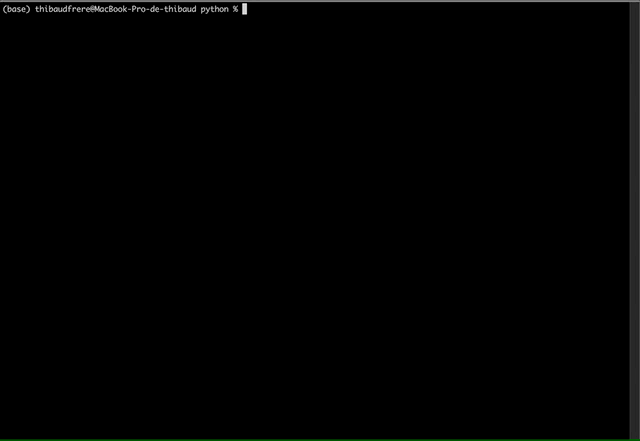
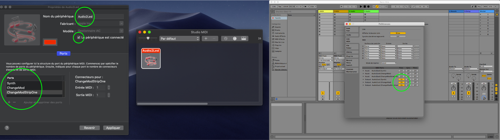

<p align="center">
  <a href="https://github.com/tfrere/music-to-led" title="haxe.org"></a>
</p>
<p align="center">
<a href="https://github.com/tfrere/music-to-led#licence"></a>
<a href="https://github.com/tfrere/music-to-led"></a>
<a href="https://github.com/tfrere/music-to-led"></a>
<a href="https://github.com/tfrere/music-to-led"></a>
</p>

#

**Music 2 Led** is an **open source app** that allows you to create **real-time audio and midi visualizations on led strips** using Arduino, Python and Electron. It was designed for **DJ**'s, **music groups** or **artists** who want to add **automated lighting effects** to their shows.

All you need is a **computer**, an **arduino** and a **ws2812b led strip**.

A standalone server version is available to allow you to run projects on raspberry pi. ( Tested with a raspberry pi 4 )
[It can be found here](https://github.com/tfrere/music-to-led-server)

# Showcase


# How it works ?


# App user interface


# What do i need to do to use it ?

1. [Download and install](https://github.com/tfrere/music-to-led/releases/download/v1.0.0-alpha/MusicToLed-1.0.0-alpha.dmg.zip)
2. [Build an arduino case](https://github.com/tfrere/python-to-led-strip)
3. [Update the CONFIG.yml](#config-file)
4. [Setup custom effects to prepare your show](#effects---modes)
5. [Update ](#effects---modes)
6. Enjoy !

# Documentation

## Config file

This is a config file example

```yml
--- # document start

# Desired framerate for all the strips

desirated_framerate: 60

# Display the GUI
# For performance reasons, please consider using GUI only for debug or work purpose

display_interface: true

# Audio ports
# List of used audio ports
# Available ports can be listed with --list-devices
# Can be changed with the option "Change audio channel"

audio_ports:
  - name: Built-in Microphone
    min_frequency: 200
    max_frequency: 12000

# Strips
# They represents independant Arduino cases

strips:
  - # Name of the strip
    # Only used in the GUI

    name: Led strip name

    # Name of the associated serial port
    # Available ports can be found with --list-devices

    serial_port_name: /dev/tty.usbserial-14210

    # Midi channels
    # Can be listed with --list-devices
    # midi_ports_for_visualization : used for midi based visualizers
    # midi_ports_for_changing_mode : used for live changing modes

    midi_ports_for_visualization:
      - USB MIDI Interface
    midi_ports_for_changing_mode:
      - LPK25

    # Default state that have to be used on start up

    active_state_index: 0

    # Physical shape
    # Represents the physical shape of the strip
    # Only used in the GUI

    physical_shape:
      - 254

# States
# These are default states for strips
# They contains all the variables that the visualizer need to run properly

states:
  - # Name of the strip
    # Only used in the GUI

    name: 'Mirrored Energy light blue'

    # Visualizer function
    # These functions can be found in the documentation below

    active_visualizer_effect: energy

    # The propagation curve is used to determine how scroll propagation will
    # work

    active_propagation_curve: ease_in

    # Default audio channel

    active_audio_channel_index: 0

    # Filters

    audio_channel_min_frequency: 200
    audio_channel_max_frequency: 12000

    # Shapes
    # Represents virtual shape that are used by the visualizer
    # Be sure they not contains odd numbers

    shapes:
      - - 50
        - 50

    # Active shape index
    # Determine what shape have to be used

    active_shape_index: 0

    # Available color schemes
    # Can be changed via "Change color scheme" function
    #
    # You can call them using hexadecimal notation or using a real name according
    # to the color list that can be found below ->
    # python-app/helpers/color/colorSchemeFormatter.py

    color_schemes:
      - - '#FF0000'
        - '#00FF00'
        - '#0000FF'
      - - red
        - green
        - blue

    # Active color scheme index
    # Determine what color scheme have to be used

    active_color_scheme_index: 0

    # Maximum allowed brightness
    # Can be used to limit the power consumption
    # Check the Arduino part readme for more informations about it

    max_brightness: 255

    # Reverse and mirror mods

    is_reverse: false
    is_mirror: false

    # Time interval value that is used in time based visualizers

    time_interval: 120

    # Chunk size used in alternate colors

    chunk_size: 5
... # document end
```

# Effects & Modes

Music To Led has 16 visualization effects and 8 mods.

They can be live changed via dedicated Midi channels. You can choose to use programs like Ableton Live to automate these changes or use a dedicated synthetiser / pad to change them manually during the show.

**Big principle**
You have to send a midi note signal for activating / modifying effects. See the doc below.

## Effects

All the examples are based on a ["red", "green", "blue"] color scheme.

### Sound based

| _Example_                                                                                                         | _Midi Note_ | _Effect name_         | _Explanation_                                                                                                                                                                                                                                                                                                                                           |
| :---------------------------------------------------------------------------------------------------------------- | :---------- | :-------------------- | :------------------------------------------------------------------------------------------------------------------------------------------------------------------------------------------------------------------------------------------------------------------------------------------------------------------------------------------------------ |
|     | C-2         | **scroll**            | Split the sound samples into N parts according to the color number in the color scheme. Then mix theses colors according to the sound samples intensity. Then scroll the strip to the right. <br/><br/><ul><li>**Speed** time_interval</li></ul>                                                                                                        |
|     | C#-2        | **energy**            | Split the sound samples into N parts according to the color number of color scheme. Then make them appear all along the strip with a length based on sample intensity and mixed with others.                                                                                                                                                            |
|  | D-2         | **channel_intensity** | Split the sound samples into N parts according to the shape parts length. Then draw a line with a length based on sample intensity with the first color of the color scheme. Then add a pixel on top on max intensity with the second color of the color scheme if available.<br/><br/><ul><li>**color** first and second color of the scheme</li></ul> |
|   | D#-2        | **channel_flash**     | Split the sound samples into N parts according to the shape parts length. Then illuminate the shape part with an brightness based on sample intensity.<br/><br/><ul><li>**color** Repeating the color scheme</li></ul>                                                                                                                                  |
|   | F-2         | **spectrum**          | Represents audio spectrum                                                                                                                                                                                                                                                                                                                               |

### Midi based

| _Example_                                                                                                        | _Midi Note_ | _Effect name_        | _Params_                                                                                                                                                                                                                  |
| :--------------------------------------------------------------------------------------------------------------- | :---------- | :------------------- | :------------------------------------------------------------------------------------------------------------------------------------------------------------------------------------------------------------------------ |
|     | F#-2        | **piano_scroll**     | Make a smooth scrolled light based on the note you play. <br/><br/><ul><li>**color** Index in color scheme according to the number of notes you are playing at the same time. </li></ul>                                  |
| TO ADD                                                                                                           | G-2         | **piano_note**       | Make a light appear based on the position where you typed on the keyboard. <br/><br/><ul><li>**color** Index in color scheme according to the number of notes you are playing at the same time. </li>                     |
|  | G#-2        | **pitchwheel_flash** | Make the whole strip illuminates according to the pitch bend intensity of your keyboard. Begin on a black strip.<br/><br/><ul><li>**brightness** Based on pitchbend. </li> <li>**color** First color of the scheme. </li> |

### Time based

| _Example_                                                                                                                | _Midi Note_ | _Effect name_               | _Params_                                                                                                                                                                                                                 |
| :----------------------------------------------------------------------------------------------------------------------- | :---------- | :-------------------------- | :----------------------------------------------------------------------------------------------------------------------------------------------------------------------------------------------------------------------- |
|  | A#-2        | **alternate_color_chunks**  | Make a pattern with chunks of colors scrolling to the right.<br/><br/><ul><li>**chunk_size** Size of a chunk </li><li>**color** Repeated color scheme </li><li>**time_interval** Relative speed of the scroll </li></ul> |
|  | B-2         | **alternate_color_shapes**  | Make chunks of colors with size based on shapes. <br/><br/><ul><li>**chunk_size** Based on shape </li><li>**color** Repeated color scheme </li><li>**time_interval** Relative speed of the scroll </li></ul>             |
| TO DO                                                                                                                    | C-1         | **transition_color_shapes** | Make the whole strip illuminates with a smooth color transition. <br/><br/><ul><li>**color** First color of the scheme </li></ul>                                                                                        |
| TO DO                                                                                                                    | C#-1        | **draw_line**               | Draw a line.<br/><br/><ul><li>**chunk_size** Based on shape </li><li>**color** First color in the scheme </li><li>**time_interval** Relative speed of the scroll </li></ul>                                              |

### Generic

| _Example_                                                                                                       | _Midi Note_ | _Effect name_       | _Params_                                                                                                                                       |
| :-------------------------------------------------------------------------------------------------------------- | :---------- | :------------------ | :--------------------------------------------------------------------------------------------------------------------------------------------- |
|     | D#-1        | **full**            | Illuminates the whole strip with the first color in your active color scheme. <br/><br/><ul><li>**color** First color in the scheme </li></ul> |
|  | E-1         | **fade_to_nothing** | Stop current visualization. Then slowly fade to black the whole strip.                                                                         |
|  | F-1         | **clear**           | Stop current visualization. Instant clear of the frame.                                                                                        |
|     | F#-1        | **fire**            | A beautiful fire. Based on nothing for the moment.                                                                                             |

## Modes

| _Example_                                                                                                                | _Midi Note_ | _Mode name_                    | _Params_                                                                                                                                                                                                                       |
| :----------------------------------------------------------------------------------------------------------------------- | :---------- | :----------------------------- | :----------------------------------------------------------------------------------------------------------------------------------------------------------------------------------------------------------------------------- |
|  | G#-1        | **toggle_reverse_mode**        | Toggle reverse effect on the strip.                                                                                                                                                                                            |
|            | A-1         | **toggle_mirror_mode**         | Toggle mirror effect on the strip.                                                                                                                                                                                             |
|             | A#-1        | **change_shape**               | Change active shape.<br/><br/><ul><li> The chosen shape is based on the note's velocity. If the note's velocity is higher than the **shapes parameter** length, take the next shape.</li></ul>                                 |
|             | B-1         | **change_color_scheme**        | Change active color scheme. <br/><br/><ul><li>The chosen color scheme is based on the note's velocity. If the note's velocity is higher than the **color schemes parameter** length, take the next color scheme.</li></ul>     |
|           | C-0         | **change audio_channel**       | Change active audio_channel. <br/><br/><ul><li>The chosen audio_channel is based on the note's velocity. If the note's velocity is higher than the **audio_channels parameter** length, take the next audio_channel.</li></ul> |
|           | C#-0        | **change_time_interval in ms** | Change active time_interval. <br/><br/><ul><li>The chosen time_interval is based on the note's velocity.</li></ul>                                                                                                             |
|           | D-0         | **change_max_Brightness**      | Change active max_brightness. <br/><br/><ul><li>The chosen max_brightness is based on the note's velocity. If the note's velocity is higher than 255, take 255.</li></ul>                                                      |
|           | D#-0        | **change_chunk_size**          | Change active max_brightness. <br/><br/><ul><li>The chosen chunk_size is based on the note's velocity.</li></ul>                                                                                                               |
|           | D#-0        | **change_state**               | Change active state. <br/><br/><ul><li>The chosen state is based on the note's velocity. If the note's velocity is higher than the **states parameter** length, take the next state.</li></ul>                                 |

# Server part

## Binary

First, download binary file that can be downloaded [here](https://github.com/tfrere/music-to-led-server/releases/download/v1.0.0-alpha/musicToLedServer-v1.0.0-alpha-osx.zip)

```
./musicToLedServer --help

-h, --help            show this help message and exit
-l, --list-devices    list available devices
--test-audio-device TEST_AUDIO_DEVICE
                      Test a given audio port.
--test-midi-device TEST_MIDI_DEVICE
                      Test a given midi port.
--test-serial-device TEST_SERIAL_DEVICE
                      Test a given serial port. This will test your arduino / led installation by
                      displaying three ( red green bue ) pixels and make them roll on the strip.
--test-config-file TEST_CONFIG_FILE
                      Test a given config file.
--single-strip SINGLE_STRIP
                      Launch the first strip without gui and multiprocessing.
                      It's for testing purpose.
--with-config-file WITH_CONFIG_FILE
                      Launch with spectific config file. Default one is
                      CONFIG.yml just near the executable.
```

**Shell interface**



## Arduino part

[Build an arduino case](https://github.com/tfrere/python-to-led-strip)

Once the wiring is finished and your code uploaded, you can test it following these simple steps :

- 1. Connect the arduino to your computer through usb cable
- 2. run ./musicToLedServer --list-devices and find the corresponding usb name
- 3. run ./musicToLedServer --test-serial-device "YOUR CORRESPONDING USB NAME"

# Configuration

This program will use Audio ports, Midi ports and Serial ports.

To help you to configure your CONFIG.yml correctly, there is a little helper that
will list all available ports for each of them.

```
./musicToLedServer --list-devices
```

## Audio channels

This program is streaming audio from the default audio input device (set by the operating system).

Examples of typical audio sources:

- Audio cable connected to the audio input jack (requires USB sound card on Raspberry Pi)
- Webcam microphone, headset, studio recording microphone, etc

On OSX you have the "Built-In Microphone" as a default choice.

### Virtual audio sources

You can use a "virtual audio device" to transfer audio playback from one application to another. This means that you can play music on your computer and connect the playback directly into the program.

#### Linux

Linux users can use [Jack Audio](http://jackaudio.org/) to create a virtual audio device.

#### OSX

On OSX, [Loopback](https://www.rogueamoeba.com/loopback/) can be use to create a virtual audio device.
For open source alternatives, you can use [Soundflower](https://github.com/mattingalls/Soundflower) and [Jack Audio](http://jackaudio.org/)

## Midi channels

This program is streaming midi from the default midi input device (set by the operating system).

### Virtual MIDI Sources

On OSX, it's pretty easy to make some virtual MIDI channels.

Example for using them with ableton live :



To virtually test MIDI, you can use VMPK. It's a virtual midi keyboard right in your operating system.

## CONFIG.yml

You can validate the config file with

```
./musicToLedServer --test-config-file "./CONFIG.yml"
```

# Contribute

If you have any idea to improve this project or any problem using this, please feel free to upload an [issue](https://github.com/tfrere/music-to-led/issues).

# Future Roadmap

- Plug and play feature on all ports
- Effect blender
- Handling more than the WS2812B led strip
- DMX handling ?

# Python installlation for developement purpose

Code is compatible with Python 3.7.

```
# on mint and for linux more generally you may have to install jack before
# apt-get install libjack-dev libasound2-dev
conda env create --name music-to-led-server --file environment.yml

conda activate music-to-led-server
```

## Deploy on raspberrypi

For Raspberry Pi it has been tested on Raspberry 4, the 4go ram version.
On Debian Buster.

Here are some conf file you can add to your debian mounted sd card to automate wifi and ssh stuff.

### Wifi automation

wpa_supplicant.conf

```
country=US # Your 2-digit country code
ctrl_interface=DIR=/var/run/wpa_supplicant GROUP=netdev
network={
ssid="YOUR_NETWORK_NAME"
psk="YOUR_PASSWORD"
key_mgmt=WPA-PSK
}
```

### SSH auto enabling

touch ssh

## Installation

```
git clone http://github.com/tfrere/music-to-led-server
pip3 install -r requirements.txt
pip3 install mido
sudo apt-get install python3-pyaudio
sudo apt-get install python3-rtmidi
sudo apt-get install libatlas-base-dev
sudo apt-get install python3-numpy
```

# License

This project was developed by Thibaud FRERE under MIT Licence.
