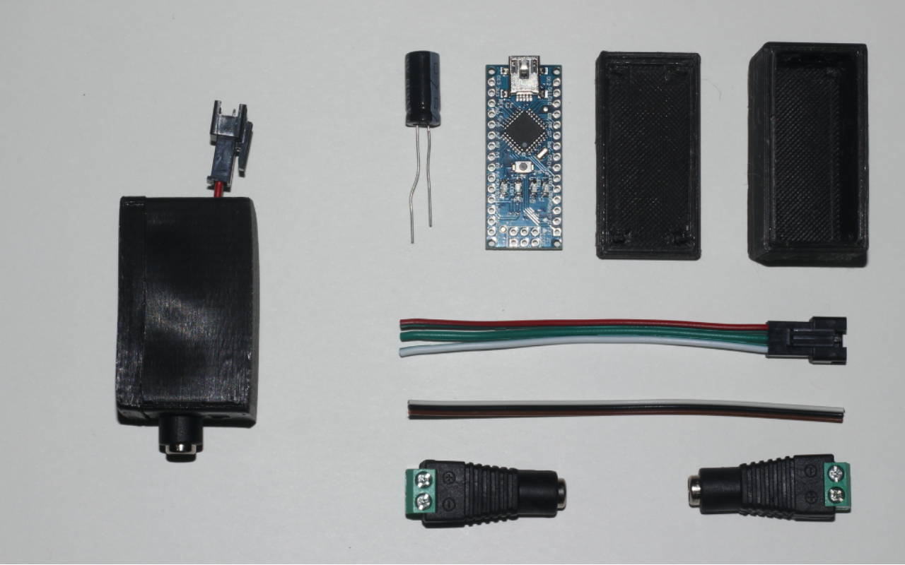
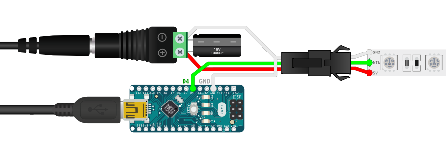

# Arduino part

### Component list

- 1x [**Alim 5V 10A**](https://www.amazon.fr/gp/product/B06XCMQ212/ref=ppx_yo_dt_b_asin_title_o00_s00?ie=UTF8&psc=1)  *~25$*
- 1x **Arduino nano or other**  *~5$*
- 1x **1000mu Capacitor**  *~1$*
- 1x [**Led strip female connector**](https://www.amazon.fr/BTF-LIGHTING-Connectors-WS2812B-WS2811-20pairs/dp/B01DC0KIT2)  *~5$*
- 1x **Led strip WS2812B**  *~35$*

**Estimated cost** *~75$*

### Electronic scheme

### 3d printed case

Slicer settings

- Supports **No**
- Resolution **0.2**
- Infill **30-100%**

### Led number limitation

It depends on two factors :
 - Your board maximum baud rate
 - Your led alimentation

For now and using the nano case, please consider not using more than 254 leds.

## Calculating led power consumtion
Each individual NeoPixel draws up to 60 milliamps at maximum brightness white (red + green + blue).

- 60 NeoPixels × 60 mA ÷ 1,000 = 3.6 Amps minimum
- 135 NeoPixels × 60 mA ÷ 1,000 = 8.1 Amps minimum
- 135 NeoPixels × 60 mA ÷ 1,000 / 2 (for each led to 125,125,125) = 4.05 Amps minimum
- 300 NeoPixels × 60 mA ÷ 1,000 = 18 Amps minimum
- 300 NeoPixels × 60 mA ÷ 1,000 / 2 (for each led to 125,125,125) = 9 Amps minimum

## In some cases you will have to install USB drivers on OSX

brew tap adrianmihalko/ch340g-ch34g-ch34x-mac-os-x-driver https://github.com/adrianmihalko/ch340g-ch34g-ch34x-mac-os-x-driver
brew cask install wch-ch34x-usb-serial-driver
